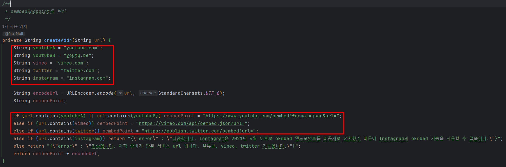
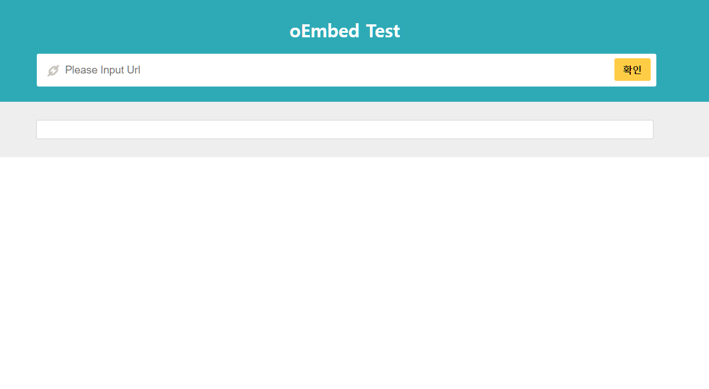
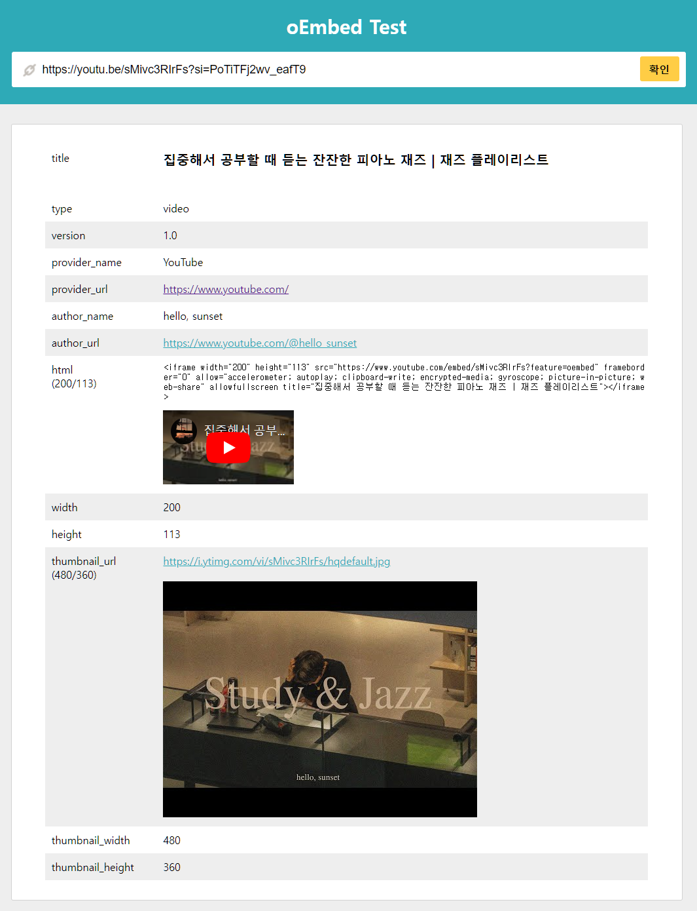
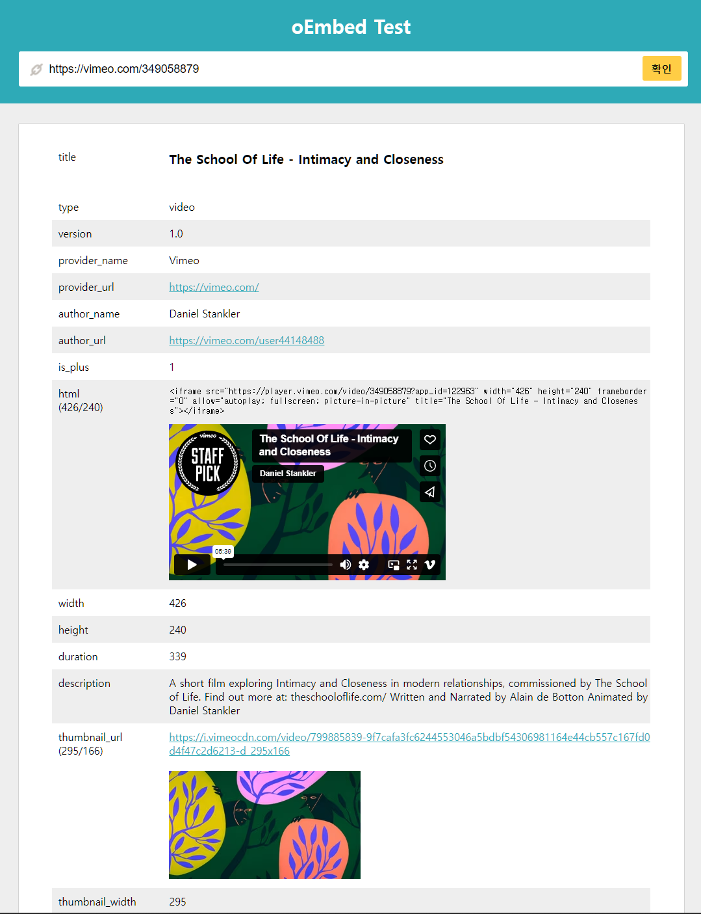
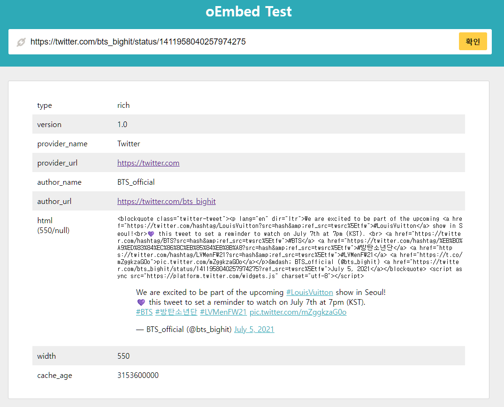
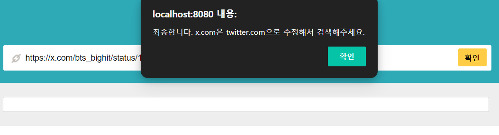

# oEmbed 서비스

### 사용한 기술
- Spring boot 2.6.6
- java17

## oEmbed란?
- oEmbed는 웹 페이지에서 다른 웹 페이지의 콘텐츠를 포함시키고 내장하는 데 사용되는 포괄적인 포맷 및 프로토콜입니다. 
- 다른 웹 페이지에서 리소스를 임베드하거나 미리보기 정보를 가져오는 데 도움이 되는 표준화된 방법을 제공합니다
- 요약 - youtube, twitter, vimeo 등의 컨텐츠를 미리 보여주는 서비스

## 서비스 설명
- 유튜브, vimeo, twitter 주소만 가능한 oEmbed서비스 입니다. 
  - [oEmbed](http://oembed.com/)
- instagram(Facebook)은 보안 문제로 인증받은 사용자한테만 데이터를 공개하므로 구현에서 제외했습니다.
- JSONParser는 사용하지 않고, 하드코딩된 문자열로 필터링하는것으로 만들었습니다.
  - (Json파일 + JSONParser를 사용하면 더 멋진코드가 될것 같습니다.)
- 다른주소가 필요하시면 더 추가해서 사용하시면 될것 같습니다.
- (해당 부분 수정하시면 됩니다.)
  

## hoxfix
- (231018) - README 작성 도중 x.com이 oEmbed 문제가 있다는걸 파악했습니다. 
  아마도 x.com이 내부적으로 twitter를 호출하는데, oEmbed는 아직 반영되지 않은것 같습니다.  
  x.com으로 호출하면 alert이 발생하고, x -> twitter로 수정해서 url 요청하도록 안내하였습니다.

## Example
1. https://youtu.be/sMivc3RIrFs?si=_mCwfVV1JSlCxjeY
2. https://vimeo.com/349058879
3. https://twitter.com/bts_bighit/status/1411958040257974275
4. https://x.com/bts_bighit/status/1411958040257974275

<h2>구현 화면</h2>

<h3>Main 화면</h3>

<h3>YOUTUBE</h3>

<h3>VIMEO</h3>

<h3>TWITTER</h3>

<h3>TWITTER가 아닌 X으로 검색할 시</h3>
